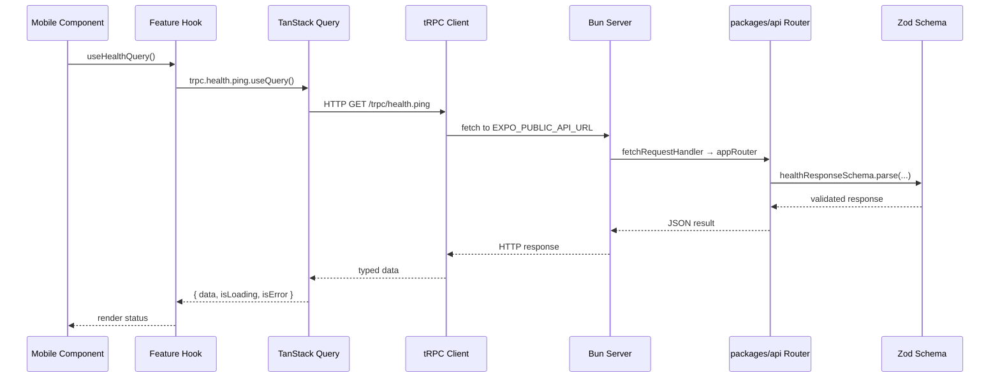
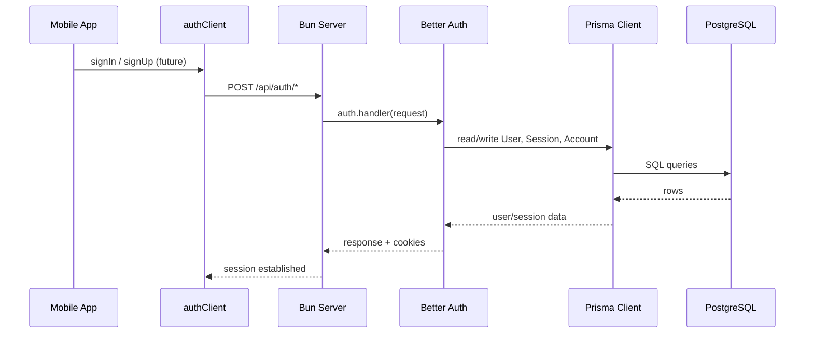
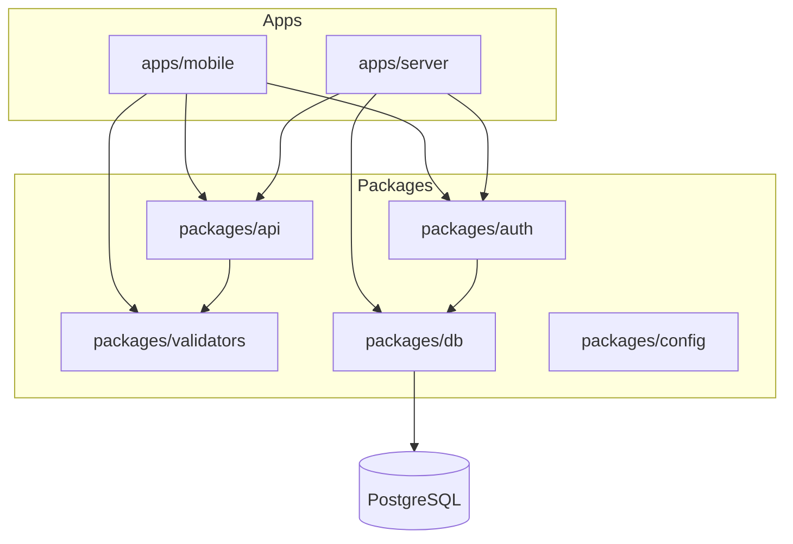

# Ascend Developer Guide

**Read this first.** This document explains what exists in the repository today, why it was built that way, how data flows through the system, and exactly how to add new features and tests.

For a shorter architecture reference, see [architecture.md](./architecture.md). For the formal planning workflow used on large changes, see [feature-implementation.md](./feature-implementation.md).

---

## Table of Contents

1. [What Is This Repository?](#what-is-this-repository)
2. [Monorepo Map — What Lives Where and Why](#monorepo-map--what-lives-where-and-why)
3. [Tech Stack](#tech-stack)
4. [How Data Flows](#how-data-flows)
5. [The Health Check Example (Walkthrough)](#the-health-check-example-walkthrough)
6. [Authentication (Structural Only)](#authentication-structural-only)
7. [Directory Conventions](#directory-conventions)
8. [Environment Variables](#environment-variables)
9. [Commands — Dev, Build, Test, Verify](#commands--dev-build-test-verify)
10. [How to Implement a Small Change](#how-to-implement-a-small-change)
11. [How to Implement an End-to-End Feature](#how-to-implement-an-end-to-end-feature)
12. [Where to Add Tests](#where-to-add-tests)
13. [What Is NOT Built Yet](#what-is-not-built-yet)
14. [Daily Workflows](#daily-workflows)
15. [Troubleshooting](#troubleshooting)

---

## What Is This Repository?

Ascend is a **full-stack monorepo foundation** — not a finished product. It wires together:

- A **mobile app** (Expo / React Native)
- A **backend server** (Bun)
- Shared **packages** for API contracts, validation, database, and auth

The only real “feature” today is a **health check**: the mobile app calls the backend via tRPC and displays whether the API is reachable. That proves the entire stack works before you build product features.

Everything else (login screens, posts, users, etc.) is **intentionally not implemented**.

---

## Monorepo Map — What Lives Where and Why

```
ascend/
├── apps/
│   ├── mobile/          # Expo React Native app (what users see)
│   └── server/          # Bun HTTP server (API + auth endpoints)
├── packages/
│   ├── api/             # tRPC routers + types (shared contract)
│   ├── auth/            # Better Auth server + client setup
│   ├── db/              # Prisma schema + database client
│   ├── validators/      # Shared Zod schemas (inputs/outputs)
│   └── config/          # Shared TypeScript configs
├── docs/                # Documentation (you are here)
├── scripts/             # Verification scripts
├── AGENTS.md            # Rules for AI agents
└── turbo.json           # Turborepo task pipeline
```

### Why separate apps and packages?

| Piece | Why it exists |
|-------|----------------|
| `apps/mobile` | The React Native UI. Runs on phones/simulators via Expo. |
| `apps/server` | The HTTP server. Handles tRPC, auth, and health routes. Thin — most API logic lives in `packages/api`. |
| `packages/api` | **Single source of truth for the API contract.** Both mobile and server import from here. Mobile gets TypeScript types; server gets routers. |
| `packages/validators` | **Shared validation.** Zod schemas used by API routers and (later) forms on mobile. One schema, validated everywhere. |
| `packages/db` | **Database access.** Prisma schema + client. Only server-side code should import this. |
| `packages/auth` | **Authentication wiring.** Better Auth configured once, used by server and mobile client. |
| `packages/config` | Shared `tsconfig` bases so every package uses the same TypeScript settings. |

### Dependency rules (important)

```
Mobile  →  api (types), auth (client), validators
Mobile  ✗  db, auth/server

Server  →  api, auth/server, db
API     →  validators only (no direct database access)
```

Breaking these rules causes build failures or security issues (e.g. exposing database access to the mobile bundle).

---

## Tech Stack

| Layer | Technology | Purpose |
|-------|------------|---------|
| Mobile framework | Expo SDK 53, React Native 0.79 | Cross-platform mobile app |
| Mobile routing | Expo Router 5 | File-based navigation (`src/app/`) |
| Mobile styling | NativeWind 4 | Tailwind CSS classes in React Native |
| Mobile data fetching | tRPC + TanStack Query | Type-safe API calls with caching |
| Mobile client state | Zustand | Lightweight stores (e.g. app ready flag) |
| Mobile forms (available) | React Hook Form + Zod | Not used in foundation yet |
| Server runtime | Bun | Fast TypeScript server |
| API layer | tRPC 11 | End-to-end typed procedures |
| Validation | Zod 3 | Runtime + TypeScript schema validation |
| Auth | Better Auth | Session-based auth with Prisma adapter |
| Database | Prisma 6 + PostgreSQL | ORM + relational database |
| Monorepo | Bun workspaces + Turborepo | Dependency management + task orchestration |
| Unit tests | Vitest | All packages and apps |
| Component tests | React Native Testing Library | Mobile UI components |

---

## How Data Flows

### API request flow (tRPC)



### Auth flow (wired but no UI yet)



### Package dependency flow



---

## The Health Check Example (Walkthrough)

This is the only working feature. Trace it file-by-file to understand the pattern for everything else.

### 1. Validator — defines the response shape

**File:** `packages/validators/src/health.ts`

```ts
export const healthResponseSchema = z.object({
  status: z.literal("ok"),
  message: z.string(),
  timestamp: z.string().datetime(),
});
export type HealthResponse = z.infer<typeof healthResponseSchema>;
```

**Why here?** One schema used by the API router (output validation) and available to mobile (TypeScript types via inference).

### 2. API router — defines the tRPC procedure

**File:** `packages/api/src/features/health/router.ts`

```ts
export const healthRouter = createTRPCRouter({
  ping: publicProcedure.query(() => {
    return healthResponseSchema.parse({
      status: "ok",
      message: "Ascend API is healthy",
      timestamp: new Date().toISOString(),
    });
  }),
});
```

Registered in `packages/api/src/root.ts`:

```ts
export const appRouter = createTRPCRouter({
  health: healthRouter,
});
export type AppRouter = typeof appRouter;
```

**Why in `packages/api`?** Mobile imports `AppRouter` for types. Server imports `appRouter` to handle requests. Same contract, zero duplication.

### 3. Server — mounts the router

**File:** `apps/server/src/index.ts`

The Bun server routes:

| Path | Handler |
|------|---------|
| `/trpc/*` | tRPC (`fetchRequestHandler` + `appRouter`) |
| `/api/auth/*` | Better Auth |
| `/health` | Simple JSON `{ status: "ok", service: "ascend-server" }` |

tRPC requests hit `appRouter` from `@ascend/api`. The server itself is thin — it does not contain business logic.

### 4. Mobile tRPC client — connects to server

**Files:**

- `apps/mobile/src/lib/api.ts` — resolves API URL from env or Expo dev host
- `apps/mobile/src/lib/trpc.ts` — creates `trpc` React hooks bound to `AppRouter`
- `apps/mobile/src/lib/providers.tsx` — wraps app in `trpc.Provider` + `QueryClientProvider`

### 5. Mobile feature hook — calls the API

**File:** `apps/mobile/src/features/health/hooks/useHealthQuery.ts`

```ts
export function useHealthQuery() {
  return trpc.health.ping.useQuery();
}
```

**Why a hook?** Components stay dumb. All tRPC/query logic lives in `hooks/`.

### 6. Mobile component — displays the result

**File:** `apps/mobile/src/features/health/components/HealthStatus.tsx`

Shows loading spinner, success message, or error state based on query result. Uses NativeWind `className` for styling.

### 7. Route — renders the component

**File:** `apps/mobile/src/app/index.tsx`

Expo Router home screen. **Only imports and renders** `HealthStatus`. No business logic in `app/`.

---

## Authentication

Google-only sign-in is implemented end-to-end.

| Piece | Location | Status |
|-------|----------|--------|
| Prisma auth models | `packages/db/prisma/schema.prisma` | User, Session, Account, Verification |
| Better Auth server | `packages/auth/src/server.ts` | Google OAuth, Expo plugin, email/password disabled |
| Server mount | `apps/server/src/index.ts` | `/api/auth/*` → `auth.handler()`, credential-safe CORS |
| Mobile client | `apps/mobile/src/lib/auth-client.ts` | Expo SecureStore + `expoClient` plugin |
| Sign-in UI | `apps/mobile/src/features/auth/` | Hero screen + Google CTA |
| Protected routes | `apps/mobile/src/app/(app)/` | Session gate in `(app)/_layout.tsx` |
| Protected API | `packages/api/src/trpc.ts` | `protectedProcedure`, `auth.me` |

Sign-in is triggered from `SignInScreen` via `authClient.signIn.social({ provider: "google" })`. Route files only wire layouts and redirects.

**Local setup:** `bun run db:up`, `bun run db:migrate`, set `GOOGLE_CLIENT_ID` / `GOOGLE_CLIENT_SECRET` in `.env`.

---

## Directory Conventions

### Mobile (`apps/mobile/src/`)

```
src/
  app/              # Expo Router ONLY — routes and layouts
  components/       # Global design system UI (import via @/components)
  features/         # Feature modules (the real app logic)
    health/
      components/   # Feature-scoped UI + *.test.tsx
      hooks/        # tRPC hooks (useQuery, useMutation)
  lib/              # Shared setup (trpc, auth, providers, tokens)
  stores/           # Zustand stores + *.test.ts
```

**Rule:** `app/` files should import from `features/` and render. Do not put API calls or business logic in `app/`.

For global UI (buttons, typography, workout cards, progress bars), use `@/components` — see [design-system.md](./design-system.md) and the [design system agent guide](./features/design-system/README.md).

### Server (`apps/server/src/`)

```
src/
  index.ts          # HTTP server entry (routing only)
  features/         # Server-specific feature logic (when needed)
```

Most API logic lives in `packages/api`, not here. Use `apps/server/src/features/` only when you need server-only code (background jobs, file uploads, etc.).

### Packages

```
packages/api/src/features/<name>/router.ts     # tRPC router
packages/api/src/features/<name>/router.test.ts
packages/validators/src/<name>.ts                # Zod schemas
packages/validators/src/<name>.test.ts
packages/db/prisma/schema.prisma               # Database models
```

---

## Environment Variables

Copy `.env.example` to `.env` at the repo root:

```bash
cp .env.example .env
```

| Variable | Used by | Purpose |
|----------|---------|---------|
| `DATABASE_URL` | Prisma | PostgreSQL connection string |
| `BETTER_AUTH_SECRET` | Better Auth | Session signing secret |
| `BETTER_AUTH_URL` | Better Auth server | Public URL of the server |
| `EXPO_PUBLIC_API_URL` | Mobile | tRPC base URL (e.g. `http://localhost:3000`) |
| `EXPO_PUBLIC_AUTH_URL` | Mobile | Auth base URL (usually same as API) |
| `PORT` | Server | Server port (default `3000`) |

**Mobile on a physical device:** `EXPO_PUBLIC_API_URL` must point to your machine's LAN IP (not `localhost`). Expo dev can auto-detect via `hostUri` in `api.ts`, but explicit env is more reliable.

**Note:** The health check and tRPC work **without a running PostgreSQL database**. Prisma client generates fine; auth and DB features need a real database.

---

## Commands — Dev, Build, Test, Verify

All commands run from the **repo root** with Bun.

### First-time setup

```bash
bun install
cp .env.example .env
bun run db:generate    # Generate Prisma client
```

### Development

```bash
# Start backend (port 3000 by default)
bun --filter @ascend/server dev

# Start mobile (Expo Metro)
bun --filter @ascend/mobile dev

# Start both via Turborepo
bun run dev
```

### Quality checks

```bash
bun run typecheck   # TypeScript across all packages
bun run lint        # ESLint (mobile) + tsc (server)
bun run test        # All Vitest tests
bun run build       # Compile/typecheck build targets
```

### Targeted tests

```bash
bun run test:unit              # Unit tests only (excludes component tests)
bun run test:component         # Mobile component tests only

# Single package
bun --filter @ascend/mobile test
bun --filter @ascend/api test
```

### Database

```bash
bun run db:generate            # Regenerate Prisma client after schema changes
# Future: prisma migrate dev   # When you add migrations
```

### Verification scripts (automated smoke tests)

| Script | What it does |
|--------|----------------|
| `bun run verify:server` | Starts server on port **3456**, hits `/health` and `/trpc/health.ping`, confirms tRPC returns `{ status: "ok" }`, then stops |
| `bun run verify:expo` | Starts Expo Metro on a free port, waits for "Waiting on" log, confirms startup, then stops |

Use these when you want a quick "does the foundation still work?" check without manually opening simulators.

---

## How to Implement a Small Change

Examples: tweak UI text, fix a bug, adjust a Zod schema, add a field to an existing response.

**Workflow:** Inspect → Implement → Test → Verify. No formal plan needed.

1. Find the relevant feature in `apps/mobile/src/features/` or `packages/api/src/features/`.
2. Make the change.
3. Run `bun run typecheck && bun run test` for affected packages.
4. If you changed API or server routing, run `bun run verify:server`.

---

## How to Implement an End-to-End Feature

Example: add a `notes` feature where users can list notes from the database.

Follow this order — **bottom-up** (data → API → UI):

### Step 1 — Database (if you need persistence)

**File:** `packages/db/prisma/schema.prisma`

```prisma
model Note {
  id        String   @id @default(cuid())
  title     String
  content   String
  createdAt DateTime @default(now())
  updatedAt DateTime @updatedAt
}
```

Then:

```bash
bun run db:generate
# bunx prisma migrate dev --name add-notes   # when DB is running
```

### Step 2 — Validators

**File:** `packages/validators/src/notes.ts`

```ts
import { z } from "zod";

export const noteSchema = z.object({
  id: z.string(),
  title: z.string(),
  content: z.string(),
  createdAt: z.string().datetime(),
});

export const noteListSchema = z.array(noteSchema);
```

Export from `packages/validators/src/index.ts`.

**Test:** `packages/validators/src/notes.test.ts`

### Step 3 — API router

**File:** `packages/api/src/features/notes/router.ts`

```ts
import { noteListSchema } from "@ascend/validators";
import { createTRPCRouter, publicProcedure } from "../../trpc";

export const notesRouter = createTRPCRouter({
  list: publicProcedure.query(async () => {
    // For now, return mock data OR inject db via context later
    return noteListSchema.parse([
      { id: "1", title: "Hello", content: "World", createdAt: new Date().toISOString() },
    ]);
  }),
});
```

Register in `packages/api/src/root.ts`:

```ts
export const appRouter = createTRPCRouter({
  health: healthRouter,
  notes: notesRouter,
});
```

**Test:** `packages/api/src/features/notes/router.test.ts`

When you need real DB access, extend `packages/api/src/context.ts` to pass `prisma` and use `protectedProcedure` for auth-gated routes.

### Step 4 — Server (usually no changes)

If the router is registered in `appRouter`, `apps/server/src/index.ts` already forwards `/trpc/*` to it. Add `apps/server/src/features/notes/` only for server-only logic.

**Test:** `apps/server/src/trpc.integration.test.ts` — add a caller test for `notes.list`.

### Step 5 — Mobile hook

**File:** `apps/mobile/src/features/notes/hooks/useNotesQuery.ts`

```ts
import { trpc } from "@/lib/trpc";

export function useNotesQuery() {
  return trpc.notes.list.useQuery();
}
```

### Step 6 — Mobile component

**File:** `apps/mobile/src/features/notes/components/NoteList.tsx`

Render list from `useNotesQuery()`. Handle loading/error states (copy pattern from `HealthStatus`).

**Test:** `apps/mobile/src/features/notes/components/NoteList.test.tsx` — mock the hook, test UI states.

### Step 7 — Mobile route

**File:** `apps/mobile/src/app/notes.tsx` (or nested route)

```tsx
import { NoteList } from "@/features/notes/components/NoteList";

export default function NotesScreen() {
  return <NoteList />;
}
```

### Step 8 — Verify

```bash
bun run typecheck
bun run lint
bun run test
bun run verify:server
```

### End-to-end feature checklist

| Step | Location | Test file |
|------|----------|-----------|
| Zod schemas | `packages/validators/src/<name>.ts` | `*.test.ts` |
| tRPC router | `packages/api/src/features/<name>/router.ts` | `router.test.ts` |
| Register router | `packages/api/src/root.ts` | — |
| Prisma models | `packages/db/prisma/schema.prisma` | — |
| Server integration | `apps/server/src/` | `trpc.integration.test.ts` |
| Mobile hook | `apps/mobile/src/features/<name>/hooks/` | — |
| Mobile component | `apps/mobile/src/features/<name>/components/` | `*.test.tsx` |
| Mobile route | `apps/mobile/src/app/` | — |

---

## Where to Add Tests

### Unit tests (Vitest)

| What | Where | Example |
|------|-------|---------|
| Zod schemas | `packages/validators/src/*.test.ts` | `health.test.ts` |
| tRPC routers | `packages/api/src/features/*/router.test.ts` | `health/router.test.ts` |
| Server integration | `apps/server/src/*.test.ts` | `trpc.integration.test.ts` |
| Zustand stores | `apps/mobile/src/stores/*.test.ts` | `app-store.test.ts` |

Run: `bun run test:unit` or `bun --filter @ascend/api test`

### Component tests (Vitest + React Native Testing Library)

| What | Where | Pattern |
|------|-------|---------|
| UI components | `apps/mobile/src/features/**/*.test.tsx` | Mock hooks, test render states |

**Pattern:** Mock the feature hook (not tRPC directly):

```tsx
vi.mock("../hooks/useHealthQuery", () => ({ useHealthQuery: vi.fn() }));
```

Run: `bun run test:component` or `bun --filter @ascend/mobile test`

### What we do NOT have

- No Detox, Maestro, Playwright, or other E2E framework
- No API HTTP-level integration tests against a live server (server tests use `createCaller` instead)

---

## What Is NOT Built Yet

| Item | Status |
|------|--------|
| Hunter profile / onboarding | Not started |
| React Hook Form usage | Package installed, not used |
| Product features (posts, workouts, etc.) | None beyond auth |
| E2E tests | Not set up |
| CI/CD pipeline | Not configured |

---

## Daily Workflows

### Start developing

```bash
bun install
cp .env.example .env   # if first time
bun run db:up          # start local Postgres (Docker)
bun run db:migrate     # apply Prisma migrations
bun run db:generate

# Terminal 1
bun --filter @ascend/server dev

# Terminal 2
bun --filter @ascend/mobile dev
```

### Before committing / opening a PR

```bash
bun run typecheck
bun run lint
bun run test
bun run build
```

### Quick smoke test (no simulator)

```bash
bun run verify:server
bun run verify:expo
```

### After changing Prisma schema

```bash
bun run db:generate
# prisma migrate dev when DB is available
```

---

## Troubleshooting

| Problem | Likely cause | Fix |
|---------|--------------|-----|
| Mobile can't reach API | Wrong `EXPO_PUBLIC_API_URL` or server not running | Start server; use LAN IP on physical device |
| `EADDRINUSE` on port 3000 | Another process using the port | Kill it or set `PORT=3456` in `.env` |
| `verify:expo` port conflict | Metro port in use | Script auto-picks free port; or set `EXPO_VERIFY_PORT` |
| Turbo git warnings | Was missing `.git` | Repo should have git initialized now |
| Prisma client errors after schema change | Client not regenerated | `bun run db:generate` |
| Babel / Metro bundling errors | Missing peer deps in Bun monorepo | Run `bunx expo install <package>` in `apps/mobile` |
| tRPC type errors after adding router | Router not in `root.ts` or mobile not rebuilt | Register in `appRouter`, restart TS server |

---

## Related Documentation

| Document | Purpose |
|----------|---------|
| [architecture.md](./architecture.md) | Concise architecture reference |
| [feature-implementation.md](./feature-implementation.md) | Formal plan/report workflow for large changes |
| [AGENTS.md](../AGENTS.md) | Rules for AI agents working in this repo |
| [README.md](../README.md) | Quick start commands |
